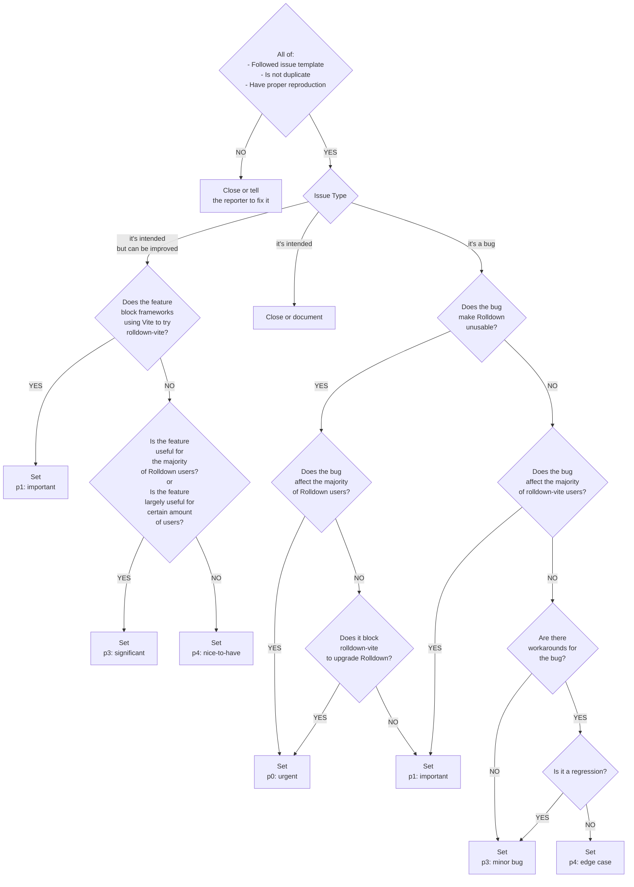

# Issue workflow decision tree.

```mermaid
flowchart TD
    start{All of:
        - Followed issue template
        - Is not duplicate
        - Have proper reproduction
        }
     start --NO--> close1["Close or tell
        the reporter to fix it"]
    start --YES--> ty{Issue Type}
    ty --it's a bug--> unusable{Does the bug
        make Rolldown
        unusable?}
    ty --it's intended--> close2["Close or document"]
    ty --it's intended
        but can be improved--> vitefr{Does the feature
        block frameworks
        using Vite to try
        rolldown-vite?}
    vitefr --YES--> p42["Set
        p1: important"]
    vitefr --NO --> frmaj{Is the feature
        useful for
        the majority
        of Rolldown users?
        or
        Is the feature
        largely useful for
        certain amount
        of users?}
    frmaj --YES--> p32["Set
        p3: significant"]
    frmaj --NO--> p22["Set
        p4: nice-to-have"]
    unusable --YES--> maj{Does the bug
        affect the majority
        of Rolldown users?}
    maj --YES--> p5["Set
        p0: urgent"]
    maj --NO--> blockvite{Does it block
        rolldown-vite
        to upgrade Rolldown?
    }
    blockvite --YES --> p5
    blockvite --NO--> p4["Set
        p1: important"]
    unusable --NO--> vite{Does the bug
        affect the majority
        of rolldown-vite users?}
    vite --YES--> p4
    vite --NO--> workarounds{Are there
        workarounds for
        the bug?}
    workarounds --NO--> p3[Set
        p3: minor bug]
    workarounds --YES--> regression{
        Is it a regression?
    }
    regression --YES--> p3
    regression --NO--> p2[Set
        p4: edge case]
```
