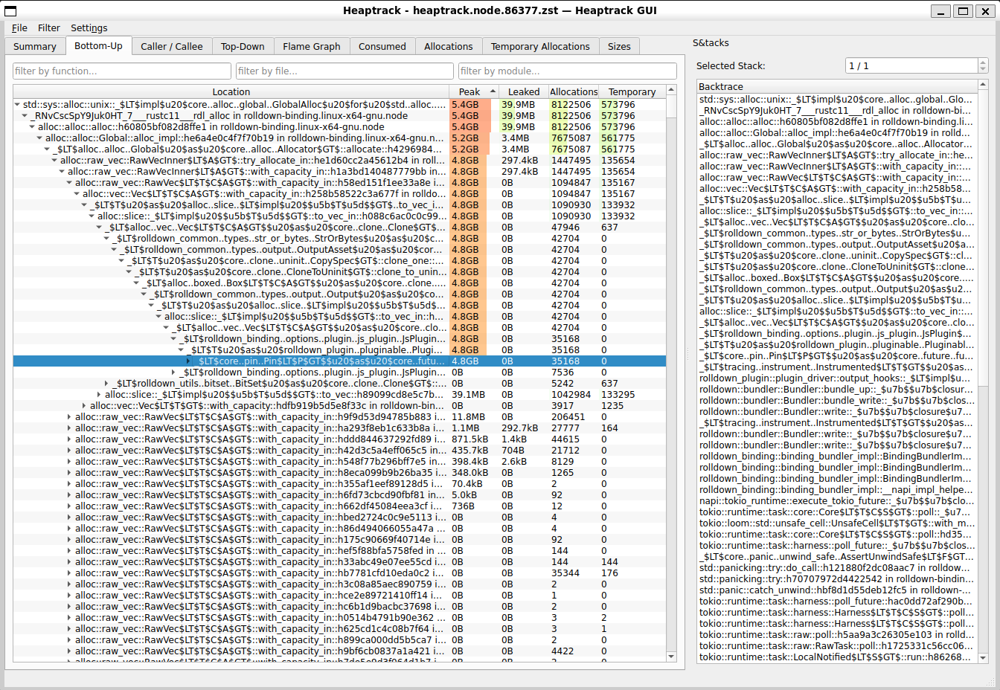

# Profiling

## CPU profiling (samply)

### Setup

First you need to install [`samply`](https://github.com/mstange/samply). You can install it with:

```bash
cargo binstall samply
```

::: warning

Samply does not work well on macOS. We recommend using Xcode Instruments instead.

:::

### Build

To build Rolldown with the information required by `samply`, you need to build it with:

```shell
just build-rolldown-profile
```

### Profiling

After building, you can run Rolldown with the following command to profile CPU usage:

```shell
samply record node ./path/to/script-rolldown-is-used.js
```

If you want to profile the JavaScript part as well, you can pass [the required flags](https://github.com/nodejs/node/pull/58010) to Node:

```shell
samply record node --perf-prof --perf-basic-prof --perf-prof-unwinding-info --interpreted-frames-native-stack ./path/to/script-rolldown-is-used.js
```

## CPU profiling (Xcode Instruments)

### Setup

First, make sure you have Xcode installed.

### Build

To build Rolldown with the information required by Xcode Instruments, you need to build it with:

```shell
just build-rolldown-profile
```

### Profiling

After building, you can run Rolldown with the following command to profile CPU usage:

```shell
xctrace record --template "Time Profile" --output . --launch -- node ./path/to/script-rolldown-is-used.js
```

then the output file path will be printed. You can open the file with:

```shell
open ./Launch_node_yyyy-mm-dd_hh.mm.ss_hash.trace
```

## Memory profiling

To profile memory usage, you can use [`heaptrack`](https://github.com/KDE/heaptrack).

### Setup

First you need to install `heaptrack` and `heaptrack-gui`. If you are using Ubuntu, you can install it with:

```bash
sudo apt install heaptrack heaptrack-gui
```

::: warning

`heaptrack` only supports Linux. It works fine on WSL.

:::

### Build

To build Rolldown with the information required by `heaptrack`, you need to build it with:

```shell
just build-rolldown-memory-profile
```

### Profiling

After building, you can run Rolldown with the following command to profile memory usage:

```shell
heaptrack node ./path/to/script-rolldown-is-used.js
```

::: tip Using asdf or other version manager that uses shims?

In that case, you may need to use the actual path to the Node binary. For example, if you are using asdf, you can run it with:

```shell
heaptrack $(asdf which node) ./path/to/script-rolldown-is-used.js
```

:::

The heaptrack GUI will open automatically after the script finishes running.


