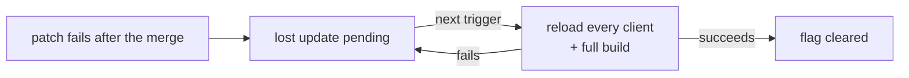

# The Dev Engine — Design & Principles (`rolldown_dev`, Full Bundle Mode)

> **Implementation map** — component layering, the `CoordinatorMsg`
> protocol, the `CoordinatorState` machine, the `TaskInput` work types, and
> the per-stage data-flow pipelines: see
> [implementation.md](./implementation.md). The `§N` section references
> below point to that file.

## Summary

The dev engine (`rolldown_dev` crate) is rolldown's dev-mode build
orchestration layer in Full Bundle Mode. It sits between the file watcher
/ dev server and the core `Bundler`, deciding _what_ build to run — an HMR
patch, an incremental rebuild, or a full build — and _when_. It is
structured as a `DevEngine` (the public async API surface) driving a
single message-loop `BundleCoordinator` (a state machine plus a work
queue) that spawns one `BundlingTask` at a time.

This document captures the **why** — the principles that govern when the
engine rebuilds and how its errors flow out to the binding consumer. For
the machinery that realizes them, see
[implementation.md](./implementation.md).

## Design principles

Four principles govern when the dev engine rebuilds and how its errors
flow out to the binding consumer. They define rolldown_dev's contract
with its consumer (typically Vite) and constrain the implementation in
§7, §13, and §16.

### 1. Conservative rebuilds

Rebuilds happen only when the bundle is **stale** — when input has
changed since the last build attempt. Page access and browser
reconnect on their own never trigger a rebuild. In particular: if the
previous build failed, an access request does not retry — without new
input the same error would recur.

Realized in: `BundleCoordinator::ensure_latest_bundle_output` returning
`None` for `Failed` / `FullBuildFailed` (§13b, §13e).

### 2. Errors are emitted on every build

rolldown_dev surfaces build errors to the binding consumer on every
build via the `on_output` / `on_hmr_updates` callbacks (§16b). It never
silently retries past an error, never silently swallows one, and never
caches one across requests — rolldown_dev is stateless across HTTP
requests. The binding consumer (Vite) keeps the most recent full-build
error and replays it to each client that connects, so the error overlay
appears again after a browser refresh.

HMR errors need no replay. A page load after an HMR-stage failure
triggers a full build (principle 3's consumer-side exception). If that
build fails, its error arrives through `onOutput` and is stored. A tab
whose WebSocket drops reloads the page when the server answers again, so
it takes the same path.

### 3. New input is the only recovery trigger

After a failed build, the engine waits for new input before rebuilding.
Inside rolldown_dev, two things count:

- **A file change.** Both Vite config edits and user-land source edits
  are valid triggers.
- **A tab opening a lazy route.** Its lazy compile changes the proxy
  module's content, and the background `Rebuild` it queues
  (`ModuleChanged`) runs in failed states too. While a lost HMR update is
  pending, that rebuild also reloads every tab (see
  [Lost HMR updates](#lost-hmr-updates)).

Nothing else counts as recovery — not page refresh, not elapsed time,
not manual UI dismissal: `ensure_latest_bundle_output` no-ops in every
failed state (§13b), so access never rebuilds on its own.

**One consumer-side exception — page refresh after an HMR-stage
failure.** When the last failure originated in HMR generation
(`last_error_stage == Hmr`), the consumer is permitted to treat a page
refresh as a recovery trigger: on access it calls `triggerFullBuild`
(§13e) to force a full rebuild that bypasses the possibly-buggy HMR
path, instead of replaying the cached error. This stays scoped to the
consumer — rolldown_dev itself does not change behavior; the escalation
is the consumer's decision, keyed on the `last_error_stage` it reads
from `BundleState` (§12). A `Rebuild`-stage or full-build failure gets
no such exception — only new input recovers those. (Wired up in Vite:
`triggerBundleRegenerationIfStale` in `bundledDev.ts`.)

Realized in: `handle_file_changes` (§7) and the `ModuleChanged` handler
(`bundle_coordinator.rs:132`) are the only producers of post-failure
rebuild tasks. `triggerFullBuild` (§13e) is an explicit escape hatch
for cases the watcher cannot observe (e.g. missing-import resolution;
see Unresolved Questions).

Corollary: a file change after a failed build must schedule work that
can undo the failure. In practice this means tracking where the
failure originated (HMR computation vs incremental rebuild) so the
next task covers the stage that broke (§7).

### 4. Build errors are recoverable; panics are bugs

Every error reaching the consumer via `on_output` / `on_hmr_updates`
is treated as a **user error** — caused by source code or plugin
behavior, recoverable by editing source. Rolldown and Vite themselves
are assumed bug-free in this model. The only state not recoverable
through a file-change cycle is a panic, which signals an invariant
violation in rolldown_dev itself (§16g).

## Lost HMR updates

An HMR update can fail after it merged its edit into the module graph,
for example when a plugin callback throws while the patch renders. No
client ran the edit, and the next patch will not carry it: the graph
already has the edit. Example: an edit to `Header.tsx` fails this way.
A later edit to `Footer.tsx` sends a patch with `Footer` only, and the
tabs keep the old `Header`.

So the engine records the loss (`Bundler::lost_hmr_update`). Its next
task reloads every client and runs a full build (§9b).

- **Reload, not resend.** Resending the edit would also need the modules
  and imports it added, for each client. The failure is rare, so one
  reload is cheaper.
- **The server decides.** Only the server knows the failure came after
  the merge. A syntax error looks the same to the client, but nothing
  merged, so it recovers with a hot update.
- **A full build.** A failure in `update_defer_sync_data` can leave the
  cache half updated. A full scan builds it again from scratch.
- **Principles 1 and 3 hold.** The upgrade never repeats by itself: a
  failed full build keeps the flag until the next trigger. No trigger is
  added, but a lazy route opened in one tab now reloads every tab. This
  is accepted, because tabs reload only after a successful build.

## Unresolved Questions

- **Auto-recovery from missing-import failures.** When a build fails
  because of an unresolved import, the missing file was never parsed and
  is not in `watch_paths`. Creating it does not trigger a rebuild — the
  user must either touch a watched file or use `triggerFullBuild`. A
  fix: during resolution, when a file is not found, record its path and
  add its parent directory to the watcher. A directory-level create event
  matching a previously-missing path would then trigger a rebuild
  automatically. The existing watcher tests acknowledge this gap
  (`watch.test.ts`: "the missing file's directory is not auto-watched,
  so we need to touch a watched file").

## Related

- [implementation.md](./implementation.md) — the dev engine's
  implementation map (components, message protocol, state machine,
  per-stage data flow)
- [hmr/design.md](../hmr/design.md) — why HMR boundary decisions run in
  the browser, and the per-client ship map the engine keeps for it
- [bundler-data-lifecycle](../bundler-data-lifecycle/implementation.md) — `BundleMode`,
  `Bundle` / `BundleFactory`, and the `ScanStageCache` lifecycle the dev
  engine's incremental builds run through
- [rust-bundler](../rust-bundler/implementation.md) — the core `Bundler` struct and build
  lifecycle the dev engine drives
- [watch-mode](../watch-mode/implementation.md) — `rolldown_watcher`, the actor-based
  watch architecture; `rolldown_dev` reuses the same actor pattern
- [lazy-compilation](../lazy-compilation/implementation.md) — lazy entry compilation,
  reached via `DevEngine::compile_lazy_entry` and the `ModuleChanged`
  message
- [dev-server-test-harness](../dev-server-test-harness/implementation.md) — browser
  test harness for the dev server
