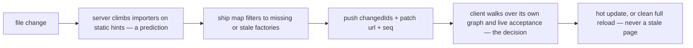
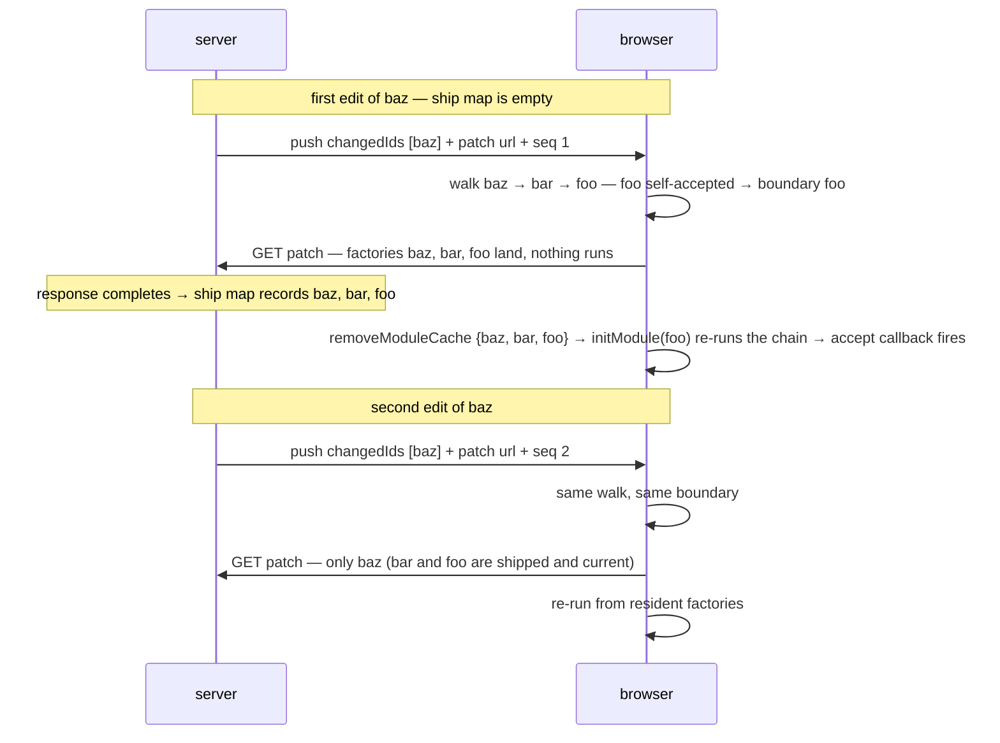

# Client-Side HMR — Design & Principles (Full Bundle Mode)

## Summary

In Full Bundle Mode (FBM), HMR decisions happen in the browser. On a
file change the server rebuilds, renders a per-client patch, and pushes
one `{changedIds, url, seq}` message. The client computes the HMR
boundary, disposes, and re-runs modules — all from its own state. Two
client-side stores make this possible: a **module factory map**
(re-runnable module code, `registerFactory`) and a **module graph**
shipped as compiler data (`registerGraph`,
`crates/rolldown/src/hmr/module_graph_delta.rs`). The server keeps one
record per client: the **ship map** `shipped[C]` — which factory
versions it has delivered to that client (`client_session.rs`).

This document records the reasons. The main question: why boundary
computation is on the client, not the server.

## The core split: each side owns only what it can observe

- The **client owns execution**: module cache (= the executed set),
  factory map, and acceptance (`hot.accept` registrations). The server
  could only learn these from client reports, and reports lag.
- The **server owns possession**: the ship map — a record of its own
  deliveries, written when it serves the bytes itself, so it can never
  be wrong about it.
- **State never travels upstream.** The client sends requests only,
  never state for the server to mirror.

Every principle below follows from this split.

## Design principles

### 1. Boundary computation runs on the client

Whether a module has **executed** decides where the boundary is: an
importer that never ran cannot accept anything. Only the browser knows
this exactly. A server-side computation must rebuild it from client
reports, and reports have no barrier — at change time the server only
knows what has already arrived. Example: a tab opens a route,
`settings.js` executes, the user saves `settings.js` while the tab's
report is still in flight — the server treats it as "never executed"
and computes a wrong update. No protocol change closes this window.

On the client the check is a module cache lookup (`isExecuted`).
Registration is emitted before the module's own statements in every
payload kind, so the module cache _is_ the executed set — exact, per
tab, nothing to wait for. Multi-tab is correct for free.

### 2. The server stays stateful — the ship map

A stateless server does not know what a client is missing, so every
update would pay an extra ask/answer round trip before codegen starts.
With the ship map, the server records what it delivered and pushes the
delta without being asked — same leg count as a design with no client
state (one push + one GET). Two rules keep the ship map correct:

- **Write at delivery, never at push.** A push can be ignored: a tab
  where no changed id executed computes a no-op and never fetches the
  patch. A push-time write would record factories the tab never
  received, so a later patch would omit them — a silently stale page.
  The write happens when the serving middleware sees the payload
  response complete (patches and lazy chunks alike). It is still the
  server recording its own action, so it cannot lag.
- **Versioned, not a plain set.** `shipped[C]` maps module id →
  rebuild stamp. Delivery is conditional, so a plain id set can point
  at a stale copy (delivered once, then skipped by a no-op update).
  Sizing is `need[C] = (affected ∖ shipped[C]) ∪ { m : latest[m] >
shipped[C][m] }` — new modules plus a staleness sweep over the whole
  ship map. Re-sending a changed module follows from the stamps.

A reconnect resets `shipped[C]` to empty. Lazy chunk sizing also
subtracts the boot-evaluated map (modules the entry chunk evaluated at
top level, frozen at hello); patches must not — their affected set is
what re-runs.

### 3. The module graph ships as compiler data

The client walk needs the import graph. Webpack learns it by
intercepting every `require`; FBM cannot — the bundle stays
**scope-hoisted** (dev keeps prod's output shape), so there are no
per-module calls to intercept. Instead, every payload starts with one
`registerGraph(delta)` statement carrying the rows of the modules it
carries — static and dynamic `import()` edges in separate sets, unioned
by `getImporters`. The client merges deltas last-write-wins into one
flat graph; re-carrying a module replaces its row.

Rejected: an edges argument on `registerModule`. Registration is
execution, so those edges would exist only for modules that ran — but
the walk needs _static_ truth (the "no importers → full reload" check
must see edges of modules this tab never ran). It also costs about 3×
the bytes of a manifest with interned ids.

### 4. The runtime is a store; HMR judgment lives in the Vite client

`__rolldown_runtime__` holds rows, module cache, and factory map, with
lifecycle verbs (`initModule`, `removeModuleCache`, `loadExports`) and
walk reads (`getImporters`, `isExecuted`, `hasFactory`). It makes no
HMR decisions. The walk, acceptance record, dispose/data, apply queue,
and reload decision live in the dedicated FBM HMR client on the Vite
side, connected through two hooks (`createModuleHotContext`,
`onModuleCacheRemoval`). Reason: acceptance is recorded where
`accept()` executes — the hot context, a Vite object — and the walk
must read that record and the graph in one consistent snapshot.
Keeping both in one object makes "boundary chosen but no callback
registered" impossible.

### 5. One factory shape — re-execution is module cache removal

`initModule(id)` skips a registered module and runs the factory
otherwise. Whether a module re-runs is decided by whether the updater
first removed it from the module cache: the HMR apply removes the
affected set (those re-run), a lazy chunk removes nothing (shared
modules are skipped), and the lazy proxy swap is one more
`removeModuleCache` caller. Rejected: a per-payload re-run flag baked
into the emitted bytes — that puts runtime policy into codegen and
cannot express "re-run this time, skip next time".

`removeModuleCache` is also where cleanup lives: each removal runs the
module's `hot.dispose` with a fresh `hot.data` bag — for every removed
module, not only the boundary (webpack-style whole-chain dispose; the
boundary-only variant is a known leak, confirmed unintentional
upstream).

A patch is therefore a **delta**, not a self-contained program: it
carries only what this client lacks or holds stale, so it has meaning
only in ship order. The client applies updates through a per-client
queue with a `seq` check; a gap becomes a full reload. This in-order
rule is the one new invariant. Lazy chunks stay outside the queue:
with delivery-time ship map writes, a chunk omits a module only if the
payload carrying it finished delivering first — concurrent fetches
both carry the shared factory (duplicate bytes, safe).

### 6. The server's remaining walk predicts, it does not decide

The server still climbs the importer graph on every change
(`collect_client_update_superset`, `hmr_stage.rs`) — no executed gate,
static accept bits as a stop heuristic. This part cannot move to the
client: the patch is an HTTP resource rendered before it is sent, and
only the server holds module sources. Its output is a prediction,
filtered through the ship map into the patch — the push carries only
`changedIds`, the walk's _inputs_. Both error directions are safe:
over-predict wastes bytes; under-predict is caught by the client's
coverage check (`hasFactory` over the update set, before anything is
removed) and becomes one clean full reload.

### Failure policy

Full reload is the fallback for delivery and state failures only:
coverage miss, `seq` gap, failed patch import, missing factory at
`initModule`. A factory that throws stays in the module cache — the
gate asks "did its side effects run", not "did it succeed". The throw
is the application's own runtime error: HMR never catches or
classifies it; the next edit re-runs the module normally.

## Worked example

Chain `app → foo → bar → baz`, `foo` self-accepts, page loaded.

The second edit shows the gain: `bar` and `foo` re-run from factories
already in the tab, so the patch shrinks to the changed module.

## Unresolved questions

- **CSS HMR** — how `css-update`, style modules, and module cache
  removal interact is unspecified; the css-update path is untouched.
- **`handleHotUpdate` / `hotUpdate`** — unsupported in FBM; the hooks
  run in Node, so at most they could mutate or veto the push.
- **Lazy dynamic-import HMR** — an edit under a lazy proxy chain
  (`app → proxy → foo`) full-reloads until the walk can see through
  proxies; proxy importers are excluded from the dynamic index.
- **Out-climb reload rate** — if the client walk often climbs past the
  server's prediction, widen the update-superset walk (more first-edit
  bytes, more hot coverage). Needs instrumentation.
- **Bundleless convergence (optional)** — bundleless Vite still drops
  a callback-less boundary silently; upgrading that to a reload would
  align the failure modes.

## Related

- [dev-engine/design.md](../dev-engine/design.md) — the dev engine that
  drives rebuilds and HMR patch generation
- [lazy-compilation/implementation.md](../lazy-compilation/implementation.md)
  — lazy entry compilation; its chunk sizing reads the ship map
- Key code: `crates/rolldown/src/hmr/module_graph_delta.rs`,
  `crates/rolldown_plugin_hmr/src/runtime/runtime-extra-dev-common.js`
  (the runtime store + executor),
  `crates/rolldown_dev/src/types/client_session.rs` (the ship map)
