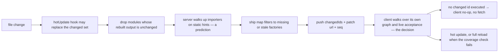
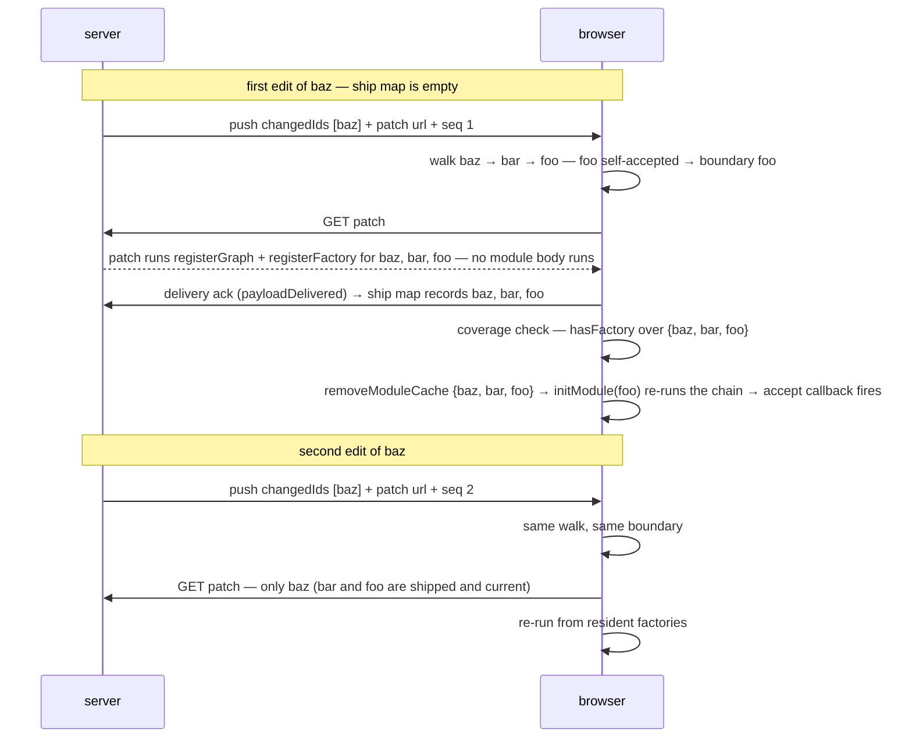

# Client-Side HMR — Design & Principles (Full Bundle Mode)

> **Implementation map** — the server-side step order lives in
> [dev-engine/implementation.md](../dev-engine/implementation.md)
> ("Inside `compute_hmr_update_for_file_changes`"); the lazy chunk path
> in [lazy-compilation/implementation.md](../lazy-compilation/implementation.md).

## Summary

In Full Bundle Mode (FBM, `bundledDev` in Vite code), HMR decisions
happen in the browser. On a file change the server rebuilds, renders a
per-client patch, and pushes one message: `changedIds` (the modules
that changed), the patch `url` (the engine emits a `filename`, Vite
turns it into a URL), and `seq` (a per-client counter of pushes). The
client computes the HMR **boundary** — the nearest executed importer
that accepts the change — disposes, and re-runs modules, all from its
own state. Two client-side stores make this possible: a **module
factory map** (re-runnable module code, `registerFactory`) and a
**module graph** shipped as compiler data (`registerGraph`,
`crates/rolldown/src/hmr/module_graph_delta.rs`). The server keeps one
record per client: the **ship map** `shipped[C]` — which factory
**stamps** have landed in that client (`client_session.rs`). A stamp is
the number of the rebuild that last put the module in the changed set
(usually because its output changed; new modules and the two
suppression exceptions in principle 6 are stamped too).

Terms used below: a **payload** is any code the server sends — the
entry chunk, a lazy chunk, or a patch. A **client** is one browser tab.

The runtime store is exported as `rolldown/experimental/runtime`; the
Vite client subclasses it and installs the HMR hooks
(`packages/vite/src/client/bundledDevClient.ts`). The HMR judgment
itself lives in Vite's `BundledDevHMRClient`
(`packages/vite/src/client/bundledDevHmrClient.ts`).

This document records the reasons. The main question: why boundary
computation is on the client, not the server. For the step order of the
server pipeline, see
[dev-engine/implementation.md](../dev-engine/implementation.md)
("Inside `compute_hmr_update_for_file_changes`").

## The core split: each side owns only what it can observe

- The **client owns execution**: module cache (= the executed set),
  factory map, and acceptance (`hot.accept` registrations). The server
  could only learn these from client reports, and reports lag.
- The **server owns possession**: the ship map — a record of which
  payloads landed in which client. It is written from a receipt the
  payload itself sends back, so it can never claim more than what was
  received.
- **The client never sends a snapshot of its state.** The HMR protocol
  has three client messages: a hello at connect, a delivery ack per
  payload (principle 2), and a reload request (Failure policy). The
  transport keepalive ping and `hot.send()` custom events carry no
  state. The server derives the ship map from the acks only.

Every principle below follows from this split.

## Design principles

### 1. Boundary computation runs on the client

Whether a module has **executed** decides where the boundary is: an
importer that never ran cannot accept anything. Only the browser knows
this exactly. Rejected: keep the computation on the server and have
clients report which modules ran. Reports have no barrier — at change
time the server only knows what has already arrived. Example: a tab
opens a route and `settings.js` runs. The user saves `settings.js`
before the tab's report reaches the server. The server thinks the module
never ran and computes a wrong update. No protocol change removes this
timing gap.

On the client the check is a module cache lookup (`isExecuted`). Every
payload kind enters a module into the module cache before the module's
own statements run, so the module cache _is_ the executed set — exact,
per client, nothing to wait for. Multiple tabs need no extra work.

The same rule covers `import.meta.hot.invalidate()`. No rebuild
happened, so there is no patch to fetch. The client walks from the
caller's executed importers on its own and applies the update from the
factories it already holds (`applyInvalidate`). The walk remembers
which module called `invalidate()` (`firstInvalidatedBy`); an update
that comes back to that module is a full reload, not a loop.

### 2. The server stays stateful — the ship map

A stateless server does not know what a client is missing, so every
update would need one extra request and reply before it can generate
code. With the ship map, the server records what landed and pushes the
delta without being asked: one push and one GET, the same cost as a
server that sends every module and keeps no record. Two rules keep the
ship map correct:

- **Write at delivery, never at push.** A push can be ignored: a client
  where no changed id executed computes a client no-op and never fetches
  the patch. A push-time write would record factories the client never
  received, so a later patch would omit them — the page keeps old code
  and nothing reports it. Delivery means "the payload's factories are
  registered in this client". Every patch and lazy chunk ends with one
  statement, `__rolldown_runtime__.payloadDelivered(filename)`, appended
  by Vite's server (`payloadDeliveredAck`). It is the last executable
  statement (a patch ends with an empty `export {}` after it), so it
  runs only after every `registerFactory` in the payload. The Vite
  runtime subclass sends it to the server as the **delivery ack**
  (`vite:bundled-dev:payload-delivered`), and the engine merges the
  pending payload's stamps into `shipped[C]`
  (`notify_payload_delivered`). If the payload throws before the last
  line, no ack is sent and `shipped[C]` does not change. The un-acked
  entry stays in the pending list (at most 8 per client, oldest dropped
  first). Its factories ship again only when a later patch's predicted
  set contains them; the stale sweep does not see them, since they are
  not in `shipped[C]`. That is safe, because registration overwrites.
  Rejected: writing when the HTTP response completes. A response can
  finish before the bytes evaluate; a second lazy chunk then omits a
  shared factory the client has not registered yet and fails with
  `MissingFactoryError` (rolldown/rolldown#10774).
- **Versioned, not a plain set.** `shipped[C]` maps module id → stamp.
  Delivery is conditional, so a plain id set can point at a stale copy
  (delivered once, then skipped by a no-op update). The patch content is
  `need[C] = (predicted ∖ shipped[C]) ∪ { m : latest[m] > shipped[C][m] }`
  (`predicted` is the server walk's result, principle 6; the code calls
  it `affected`): modules the client lacks, plus every module the client
  holds at an older stamp. The server finds the second group by checking
  every module stamped this session against the ship map.

The hello (`vite:client-connected`) creates the session. Vite's client
script sends it; the HTML plugin loads that script as a module before
the entry chunk. The session starts with an empty `shipped[C]` plus the
**boot-evaluated map**, frozen at hello: the modules the entry chunk
runs at top level, with their stamps (the static-import closure of the
single user entry; with more than one user entry the map is empty and
lazy chunks ship everything). This map is a static statement about what
the entry chunk _contains_; the client cannot contradict it (see
Unresolved Questions, "Hello without a build id"). On reconnect the
client sends a new id, and that new id is the per-client reset: the
server keeps an existing session when a hello repeats an id.

The two per-client payload kinds (lazy chunk and patch) subtract
different things. A lazy chunk subtracts both maps: nothing already
evaluated re-runs, and a boot module's live exports are enough. A patch
subtracts the ship map only. The entry chunk is scope-hoisted (principle 3) and registers no factories, so a boot module has exports but no
re-runnable code. A patch that re-runs it must ship its factory once;
after that the ship map covers it.

### 3. The module graph ships as compiler data

The client walk needs the import graph. Webpack learns it by
intercepting every `require`; FBM cannot — the bundle stays
**scope-hoisted** (all modules share one function scope, as in prod, so
there is no per-module wrapper call to hook). Instead, every payload
starts with one `registerGraph(delta)` statement with one graph row per
module in the payload: its static and dynamic `import()` edges, in
separate sets, unioned by `getImporters`. The client merges deltas into
one flat graph; the newest row for a module replaces the older one.

Rejected: an edges argument on `registerModule` (the call that enters a
module into the module cache). A module registers itself only when it
runs, so those edges would exist only for modules that ran — but the
walk needs the full static graph. When the walk reaches a module whose
importers never ran, it must know whether importers exist at all: "no
importers" and "importers exist but none ran" are the same reload
reason, but the check needs the edges to say so. Per-module edges also
cost more bytes: each row would repeat its importer ids as strings,
while the delta interns each id once.

### 4. The runtime is a store; HMR judgment lives in the Vite client

`__rolldown_runtime__` (`DevRuntime`) holds graph rows, the module
cache, and the factory map, with lifecycle methods and read-only
queries (listed under Related). It makes no HMR decisions. The walk,
acceptance record, dispose/data, apply queue, and reload decision live
in `BundledDevHMRClient` on the Vite side, connected through two hooks
(`createModuleHotContext`, `onModuleCacheRemoval`). Reason: acceptance
is recorded where `accept()` executes — the hot context, a Vite
object — and the walk must read that record and the graph in one
consistent snapshot. Keeping both in one object means the walk can
never pick a boundary from static data that the module did not accept
at runtime.

The runtime is a plain export (`rolldown/experimental/runtime`), and
Vite extends the class instead of patching it. The `vite:beforeUpdate`
and `vite:afterUpdate` listener payloads mirror bundleless Vite's
`js-update` entries, one per boundary, so plugin listeners keep working.
Rolldown's own tests carry a reduced copy of the Vite walk (same shape,
without partial accept) in `crates/rolldown_testing/src/hmr-runtime.js`,
so engine fixtures can assert hot updates without a Vite checkout.

### 5. One factory shape — re-execution is module cache removal

The same factory code serves the first run and every re-run; the
runtime never emits a second variant. `initModule(id)` skips a module
already in the module cache and runs the factory otherwise. Whether a
module re-runs is decided by whether the updater first removed it from
the module cache: the HMR apply removes the update set (those re-run);
a lazy chunk removes nothing (shared modules are skipped). Rejected: a
per-payload re-run flag written into the generated code — that puts
runtime policy into codegen and cannot express "re-run this time, skip
next time".

A lazy `import()` goes through the same gate. The proxy stub removes
its own id from the cache before it fetches the lazy chunk, and the
chunk's `initModule` tail then re-runs it (see
[lazy-compilation/design.md](../lazy-compilation/design.md)).

`removeModuleCache` is also where cleanup lives: each removal runs the
module's `hot.dispose` with its `hot.data` object — for every removed
module, not only the boundary. This is the webpack-style whole-chain
dispose. Disposing only the boundary is a known leak; upstream confirmed
it was not intended. The `hot.data` object is kept, so the re-run module
reads what `dispose` stored in it, as in bundleless Vite.

### 6. The server's remaining walk predicts, it does not decide

The server still walks up the importer graph on every change
(`collect_client_update_superset`, `hmr_stage.rs`). It has no executed
check and uses the static accept flags as an approximate stop rule. This
part cannot move to the client: the patch is an HTTP resource rendered
before it is sent, and only the server holds module sources. Its output
is a prediction, filtered through the ship map into the patch. The push
carries only the walk's input (`changedIds`), never its result.
Over-predict wastes bytes. Under-predict is caught by the client's
coverage check (`hasFactory` over the update set, before anything is
removed) and becomes one clean full reload. The coverage check is the
only guard: a factory that goes missing after it has passed is not
recovered (see Failure policy).

Three names for three sets: the **changed set** (`changedIds`, the walk
seed), the **predicted set** (the server walk's result, what the patch
may carry), and the **update set** (the client walk's result, what
re-runs).

Two steps shape the changed set before the server walk runs. Both edit
the seed only; the client-side decision is unchanged.

- **The `hotUpdate` plugin hook** runs first. A plugin may replace the
  changed set for a file — a config file that affects many modules, a
  content file that is not a module at all. The hook runs only when the
  `dev.hotUpdate` option is on (off by default, see Unresolved
  Questions). Vite does not pass this option yet.
- **Unchanged-output suppression** runs second. If a module's rendered
  output is byte-identical before and after the rebuild, it is dropped
  from the changed set. A save with no effective change no longer
  re-runs the module and discards its state. When the changed set ends
  up empty, every client gets `HmrUpdate::Noop` (a server no-op,
  distinct from the client no-op in principle 2). `Noop` is server-wide:
  a client whose patch would carry no factory still gets a push with
  `changedIds` and a new `seq`. Two cases ship anyway: everything after
  an errored build (clients stuck on the error overlay must receive the
  recovery), and modules a `hotUpdate` hook returned (the change may
  live outside the module's own code, so identical output proves
  nothing).

The rules of both steps are in
[dev-engine/implementation.md](../dev-engine/implementation.md).

```mermaid
flowchart LR
  A["file change"] --> H["hotUpdate hook may replace the changed set"]
  H --> U["drop modules whose rebuilt output is unchanged"]
  U --> B["server walks up importers on static hints — a prediction"]
  B --> C["ship map filters to missing or stale factories"]
  C --> D["push changedIds + patch url + seq"]
  D --> E["client walks over its own graph and live acceptance — the decision"]
  E --> N["no changed id executed → client no-op, no fetch"]
  E --> F["hot update, or full reload when the coverage check fails"]
```

### 7. Patches are ordered deltas

A patch carries only what this client lacks or holds stale, so it has
meaning only in ship order. This is new compared with bundleless Vite,
where each update is self-contained. The client applies updates through
a per-client queue with a `seq` check; a gap becomes a full reload. Lazy
chunks stay outside the queue. The ship map is written at ack time, so a
chunk omits a module only if the payload carrying it was acked first.
Concurrent fetches both carry the shared factory. The result is
duplicate bytes, which is safe.

## Failure policy

Full reload is the fallback for these delivery and state failures:

- coverage miss (`hasFactory` over the update set fails)
- `seq` gap
- failed patch import
- no executed importer on the walk
- an `invalidate()` walk that returns to its caller
- a boundary inside an import cycle that throws on re-run (the cycle's
  execution order cannot be recovered; same rule as bundleless Vite)

Not covered today: a factory missing at `initModule` time. The coverage
check runs before any module is removed, so this happens only when a
factory disappears after the check, or on the lazy path, which has no
coverage check. The runtime throws `MissingFactoryError`. During an HMR
apply the apply queue only logs it, and the update set is already
removed from the module cache, so the page stays alive with modules
that never re-ran. On the lazy path the `import()` promise rejects.
See Unresolved Questions, "Missing factory after the coverage check".

A factory that throws outside a cycle stays in the
module cache (principle 1). The throw is the application's own runtime
error: HMR does not classify or recover from it. The apply queue logs
it as a failed update, and the next edit re-runs the module normally.

The client does not reload itself for HMR failures. It sends
`vite:bundled-dev:reload-needed` with the reason. The server sends
`full-reload` to that client only, debounced, and holds it while a
build error is on screen so the overlay is not replaced by a broken
page. One exception: on the first update after the page loaded with a
build error already on screen, the shared Vite client hook
(`clearOverlayOrReloadOnFirstUpdate`) reloads directly, because the
page never fully loaded.

The engine emits a full reload on its own only when the graph must be
rebuilt from scratch (a tsconfig change, `bundling_task.rs`). Vite's
server sends its own reload in two more places. Once after the initial
build, for the fallback page. And when a page request finds the output
stale or the last HMR stage failed (`triggerBundleRegenerationIfStale`,
called from the HTML middleware); nothing happens until a client
requests the page.

## Worked example

Chain `app → foo → bar → baz`, `foo` self-accepts, page loaded.

```mermaid
sequenceDiagram
  participant S as server
  participant B as browser
  Note over S,B: first edit of baz — ship map is empty
  S->>B: push changedIds [baz] + patch url + seq 1
  B->>B: walk baz → bar → foo — foo self-accepted → boundary foo
  B->>S: GET patch
  S-->>B: patch runs registerGraph + registerFactory for baz, bar, foo — no module body runs
  B->>S: delivery ack (payloadDelivered) → ship map records baz, bar, foo
  B->>B: coverage check — hasFactory over {baz, bar, foo}
  B->>B: removeModuleCache {baz, bar, foo} → initModule(foo) re-runs the chain → accept callback fires
  Note over S,B: second edit of baz
  S->>B: push changedIds [baz] + patch url + seq 2
  B->>B: same walk, same boundary
  B->>S: GET patch — only baz (bar and foo are shipped and current)
  B->>B: re-run from resident factories
```

The first patch ships all three factories because the entry chunk has
none (principle 2). The second edit shows the gain: `bar` and `foo`
re-run from factories already in the client, so the patch shrinks to
the changed module.

## Unresolved Questions

- **CSS HMR** — CSS goes through the JS walk today: a style module
  re-runs and calls `updateStyle` through `import.meta.hot._internal`
  (untyped, marked TODO in `bundledDevClient.ts`). `hot.prune`, the
  `css-update` message, and module cache removal for styles are
  unspecified. `hot.prune` callbacks never run in FBM, because the
  server never sends a `prune` message.
- **`hotUpdate` gate** — the engine hook exists but `dev.hotUpdate`
  stays off by default until file-to-module invalidation is complete
  (rolldown/rolldown#10714): the set a hook receives is not yet correct
  for query-variant modules. Vite does not pass the option and does not
  run its `handleHotUpdate` / `hotUpdate` hooks in FBM yet.
- **Lazy dynamic-import HMR** — an edit under a lazy boundary
  (`app → proxy → foo`, where the proxy is the placeholder module that
  stands in for a lazy-compiled module) full-reloads until the walk can
  follow an edge through a proxy. The server excludes proxy importers
  from its dynamic index (`rebuild_importer_sets`, `ecma_view.rs`).
  Nothing registers under the proxy id in the client, so the client
  walk finds no executed importer and asks for a reload.
- **Hello without a build id** — a client that loaded an output older
  than the latest rebuild gets the newer boot-evaluated map at hello.
  Two mismatches follow, until the hello carries a build id:
  - A module that is new to the entry chunk reads as evaluated. Lazy
    sizing skips it, the client has no factory, `initModule` throws
    `MissingFactoryError`, and the `import()` rejects (no reload, see
    the next item).
  - A module that was in the older entry chunk and changed since reads
    as current. Lazy sizing skips it and the client serves its stale
    boot exports. Nothing errors and nothing reloads. It is not in
    `shipped[C]`, so the stale sweep never sees it; it ships only when
    a later edit puts it in the predicted set.
- **Missing factory after the coverage check** — `MissingFactoryError`
  from `initModule` is not turned into a reload (Failure policy). Known
  entry points: the build-id gap above, and a payload that threw before
  its ack. The fix is a reload request from the apply queue's catch and
  from the lazy proxy stub.
- **Reloads from the client walk going past the prediction** — if the
  client walk often climbs past the server's predicted set, widen the
  server walk (more first-edit bytes, more hot coverage). Needs
  instrumentation.
- **Bundleless convergence (optional)** — bundleless Vite picks
  boundaries from static analysis; when the chosen module never
  registered a live `accept` callback, the update is dropped silently.
  Upgrading that to a reload would align the failure modes with FBM.

## Related

- [dev-engine/design.md](../dev-engine/design.md) — the dev engine that
  drives rebuilds and HMR patch generation
- [dev-engine/implementation.md](../dev-engine/implementation.md) — the
  step order inside `compute_hmr_update_for_file_changes`
- [lazy-compilation/design.md](../lazy-compilation/design.md) — the
  `rolldown:exports` proxy contract; lazy chunk sizing reads the ship map
- Runtime API (`runtime-extra-dev-common.js`): lifecycle methods
  `registerGraph`, `registerFactory`, `registerModule`, `initModule`,
  `removeModuleCache`, `loadExports`; read-only queries
  `getImporters`, `isExecuted`, `hasFactory`; hooks
  `createModuleHotContext`, `onModuleCacheRemoval`
- Key code: `crates/rolldown/src/hmr/module_graph_delta.rs`,
  `crates/rolldown_plugin_hmr/src/runtime/runtime-extra-dev-common.js`
  (the runtime store + executor),
  `crates/rolldown_dev/src/types/client_session.rs` (the ship map),
  `crates/rolldown_dev/src/dev_engine.rs` (`notify_payload_delivered`),
  `crates/rolldown_testing/src/hmr-runtime.js` (test mirror of the walk)
- Vite side: `packages/vite/src/client/bundledDevHmrClient.ts` (the
  walk, apply queue, invalidate), `packages/vite/src/client/bundledDevClient.ts`
  (runtime subclass + hooks), `packages/vite/src/node/server/bundledDev.ts`
  (delivery ack, reload requests)
