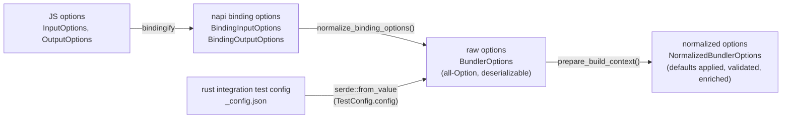

# Options Normalization

## Summary

User-facing options reach the bundler core through a small pipeline of distinct
types rather than one shared struct. The JS API types are converted to NAPI
binding types, the binding types are lowered to a raw `BundlerOptions`, and only
then is `BundlerOptions` normalized into the `NormalizedBundlerOptions` the core
actually consumes. The Rust integration tests skip the JS and NAPI layers
entirely and deserialize a `BundlerOptions` straight from a `_config.json`
fixture.

The point of the design is the **convergence at `BundlerOptions`**: every
frontend produces the same raw struct, and a single function
(`prepare_build_context`) turns that raw struct into normalized options. Tests
and production therefore share one normalization implementation, so a fixture
exercises the exact defaulting/validation logic that ships.

## The Layers

The two arrows in the high-level "everything flows into normalized options"
sketch do **not** merge at `NormalizedBundlerOptions`. They merge one stage
earlier, at `BundlerOptions`, and a single `prepare_build_context` call does the
normalization for both.

| Layer                     | Type                                                                                            | Defined / converted in                                                                              |
| ------------------------- | ----------------------------------------------------------------------------------------------- | --------------------------------------------------------------------------------------------------- |
| JS options                | `InputOptions`, `OutputOptions`                                                                 | `packages/rolldown/src/options/input-options.ts`, `output-options.ts`                               |
| JS → binding              | `bindingifyInputOptions()`, `bindingifyOutputOptions()`                                         | `packages/rolldown/src/utils/bindingify-input-options.ts`, `bindingify-output-options.ts`           |
| napi binding options      | `BindingInputOptions`, `BindingOutputOptions`                                                   | `crates/rolldown_binding/src/options/binding_input_options/mod.rs`, `binding_output_options/mod.rs` |
| binding → raw             | `normalize_binding_options()` → `BundlerConfig { options: BundlerOptions, plugins }`            | `crates/rolldown_binding/src/utils/normalize_binding_options.rs:191`                                |
| raw options (convergence) | `BundlerOptions`                                                                                | `crates/rolldown_common/src/inner_bundler_options/mod.rs:54`                                        |
| raw → normalized          | `prepare_build_context()` → `PrepareBuildContext { options: Arc<NormalizedBundlerOptions>, … }` | `crates/rolldown/src/utils/prepare_build_context.rs:163`                                            |
| normalized options        | `NormalizedBundlerOptions` (`SharedNormalizedBundlerOptions = Arc<…>`)                          | `crates/rolldown_common/src/inner_bundler_options/types/normalized_bundler_options.rs:42`           |

Both `Bundler::new(BundlerOptions)` and `BundleFactory::new` funnel into
`prepare_build_context` (`bundle_factory.rs:68`), so there is exactly one place
where raw options become normalized options.

## Why Each Layer Exists

### Why a NAPI binding layer separate from JS options

`InputOptions`/`OutputOptions` are the DX-facing API: they accept JS functions
(plugins, `external` predicates, `onLog`, sourcemap transforms), nested objects,
and union-typed sugar. NAPI cannot carry those shapes verbatim, so
`bindingify*` lowers them into FFI-compatible `Binding*` structs — wrapping JS
callbacks as threadsafe functions, flattening unions, and so on. The binding
types are shaped by FFI constraints, not by ergonomics.

### Why a raw `BundlerOptions` distinct from `NormalizedBundlerOptions`

`BundlerOptions` is the "raw, nothing-resolved" struct: nearly every field is an
`Option`, no defaults are applied, and no cross-field validation has run. Two
properties make it the right convergence point:

- It is **cheap to construct from any frontend** — you only set the fields you
  care about and leave the rest `None`.
- It is **`serde`-deserializable** (`#[derive(Deserialize, JsonSchema)]` behind
  the `deserialize_bundler_options` feature — `mod.rs:49-54`), so it can be
  built from JSON with no JS runtime in the loop.

`NormalizedBundlerOptions` is the opposite: every field is resolved, defaults
are applied, options are validated and enriched, and derived state is computed.
This is the only form the core depends on. Its own doc comment states the split
directly — the raw options are "meant to provide dx-friendly options for the
`rolldown` users, but it's not suitable for the `rolldown` internal use"
(`normalized_bundler_options.rs:1-2`).

`prepare_build_context` is where the gap is closed: it runs `verify_raw_options`
(`prepare_build_context.rs:41`) to collect errors/warnings, then applies every
default and derivation — format-driven `platform`, `process.env.NODE_ENV`
define injection, the built-in `module_types` table, `out_dir` from
`file`/`dir`, tsconfig-merged transform options, minify normalization, etc. The
function is deliberately one long mapping (`#[expect(clippy::too_many_lines)]`):
keeping all normalization in a single place is what guarantees every frontend
gets identical results.

### Why the Rust test path bypasses JS/NAPI

This is the payoff of making `BundlerOptions` deserializable. A test fixture's
`_config.json` deserializes straight into the same struct the binding produces:
`TestConfig.config` is literally `rolldown_common::BundlerOptions`
(`crates/rolldown_testing_config/src/test_config.rs:8-10`, with the
`deserialize_bundler_options` feature enabled in that crate's `Cargo.toml:17`).
The fixture runner reads the config (`fixture.rs:52-54` → `read_test_config`),
applies a layer of **test-harness defaults** to the still-raw `BundlerOptions`
(`fixture.rs:56-58` sets `cwd`; `IntegrationTest::apply_test_defaults` at
`integration_test.rs:530` fills `cwd`, `external`, `input`, `entry_filenames`,
`chunk_filenames`, `checks`, … when unset), and only then builds
`Bundler::new(options)` (`integration_test.rs:59-62`), which runs the **same**
`prepare_build_context` as production.

The result:

- Integration tests exercise the Rust core in isolation — fast, declarative
  JSON, no Node process — running the production normalization and validation.
- **Defaulting caveat:** because the harness pre-fills the fields above before
  `Bundler::new`, an omitted fixture field exercises the _test-harness_ default
  for those keys, not the production default in `prepare_build_context`. Only
  fields the harness leaves untouched fall through to the production default —
  keep this in mind when writing option-normalization tests.
- The `_config.json` schema (`_config.schema.json`) is generated from the
  `JsonSchema` derive on the same struct, so the fixture format can't drift from
  the real option set.

A second frontend that produces `BundlerOptions` (the JSON test config) is the
concrete proof that the convergence point is `BundlerOptions`, not the NAPI
binding.

## Unresolved Questions

- The intent doc comment on `NormalizedBundlerOptions` references
  `crate::InputOptions`, but the raw struct is named `BundlerOptions` (no such
  alias exists in `rolldown_common`). The comment is worth re-pointing at
  `BundlerOptions` to avoid confusion.

## Related

- [cli](../cli/implementation.md) — CLI argument parsing; the upstream stage that produces JS
  `InputOptions`/`OutputOptions` before this pipeline begins
- [rust-bundler](../rust-bundler/implementation.md) — `Bundler`/`BundleFactory`, which hold the
  resulting `Arc<NormalizedBundlerOptions>`
- `crates/rolldown/src/utils/prepare_build_context.rs` — the single
  raw → normalized normalization function
- `crates/rolldown_binding/src/utils/normalize_binding_options.rs` — binding →
  raw lowering
