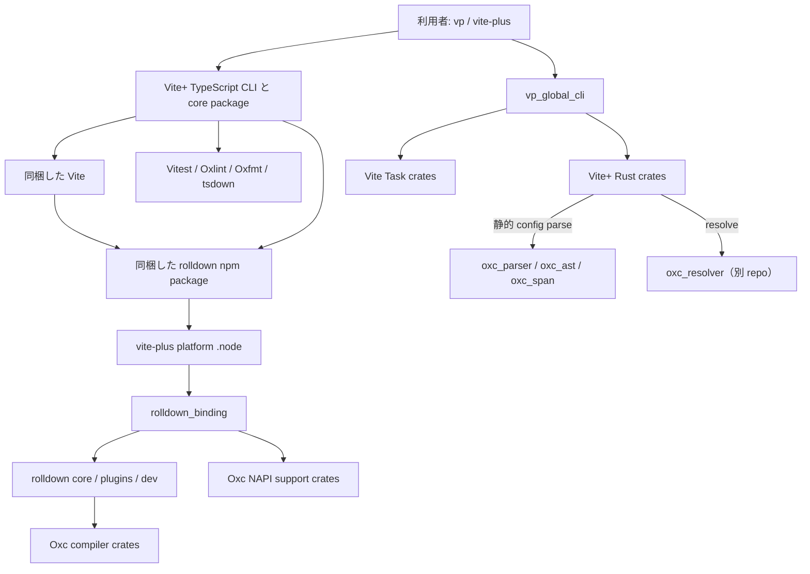

# Oxc・Rolldown・Vite+ の全体構成

## Summary

Oxc、Rolldown、Vite+ は同じものを三分割したリポジトリではなく、異なる抽象度を持つ一方向の積層である。

- **Oxc** は JavaScript / TypeScript を読む・理解する・書き換えるためのコンパイラ部品群を提供する。
- **Rolldown** は Oxc の AST、parser、semantic、transform、minifier、codegen などを使い、モジュール解決、module graph、link、chunk、plugin hook を加えてバンドラを構成する。
- **Vite+** は Rolldown と Oxc を単にライブラリ利用するだけでなく、Vite、Vitest、Oxlint、Oxfmt、tsdown、Vite Task、runtime / package manager 管理を一つの `vp` 製品として配布する。

依存方向は原則として `Vite+ -> Rolldown -> Oxc` であり、Oxc から Rolldown や Vite+ への依存はない。ただし Vite+ は設定の静的解析と module resolution のため Oxc 系 crate も直接利用する。



この図で重要なのは、製品としての統合経路が Rust の crate graph だけでは完結しない点である。Vite+ は Rolldown の JavaScript package を `@voidzero-dev/vite-plus-core/rolldown` 以下へコピーし、その native binding の参照先を Vite+ 自身の platform package に書き換える。

## 調査範囲と source of truth

この文書は 2026-08-14 時点の次の checkout と manifest を基準にしている。

| Repository               | 調査した revision                                          | 主な source of truth                                                                                            |
| ------------------------ | ---------------------------------------------------------- | --------------------------------------------------------------------------------------------------------------- |
| `oxc-project/oxc`        | `88d5d94dfe166be62dc14032ec36b77cdf13ecc7` (`oxc` 0.144.0) | `Cargo.toml`、各 crate manifest、`crates/oxc/README.md`                                                         |
| `rolldown/rolldown`      | `f34f3289548e418e548726557e96dda4faf27174`                 | `Cargo.toml`、各 crate manifest、`internal-docs/`                                                               |
| `voidzero-dev/vite-plus` | `5a9fd2b0a38039314d31b3793a298d4aee26fa17`                 | `Cargo.toml`、`packages/tools/src/sync-remote-deps.ts`、`packages/core/BUNDLING.md`、`packages/cli/BUNDLING.md` |

Vite+ が実際に固定している Rolldown は `packages/tools/.upstream-versions.json` の `483c64833c0fb0d1b75f1339accf781c0a09b335`（2026-08-12、v1.2.4）である。調査した Rolldown HEAD との差分には crate manifest の追加・削除がないため、以下の crate inventory は固定 revision にも適用できる。

crate の存在と依存は manifest を source of truth とした。README の役割説明と実コードが食い違う場合は実コードを優先する。例えば Vite+ の `packages/core/BUNDLING.md` は Rolldown checkout を “Git submodule” と呼ぶ箇所があるが、現行実装には `.gitmodules` がなく、`rolldown/` は `.gitignore` 対象で、`sync-remote-deps.ts` が固定 revision を clone / reset する。

## 三者の責務境界

| 層       | 所有する責務                                                                                                                              | 所有しない責務                                                               |
| -------- | ----------------------------------------------------------------------------------------------------------------------------------------- | ---------------------------------------------------------------------------- |
| Oxc      | source text、arena-backed AST、syntax / semantic、CFG、transform、minify / mangle、codegen、lint、format                                  | module graph、chunking、Rollup plugin lifecycle、dev server、package manager |
| Rolldown | resolve、load / transform hook、module graph、symbol link、tree shaking、chunking、render、asset emission、watch / HMR、NAPI API          | lint / format 製品、Node runtime 管理、package manager、Vite dev server 全体 |
| Vite+    | 統合 CLI、Vite / Vitest / Rolldown / Oxc 製品の配布、runtime、package manager、task graph、create / migrate / check / test / build / pack | compiler primitive や bundler core algorithm の再実装                        |

同じ Oxc が二つの形で上位へ現れる。

1. Rolldown はコンパイラ library として Oxc crate を内部処理に使う。
2. Vite+ は Oxlint / Oxfmt をエンドユーザー向け command として束ね、さらに `vp_static_config` から Oxc parser を直接使う。

## Oxc workspace

Oxc は 66 workspace package からなる。内訳は `crates/` 42、`apps/` 2、`napi/` 6、`tasks/` 16 である。

典型的な compiler pipeline は次の通り。

```text
source text
  -> oxc_lexer / oxc_parser
  -> oxc_ast (+ oxc_allocator, oxc_span)
  -> oxc_semantic (+ oxc_cfg)
  -> oxc_transformer / oxc_minifier / oxc_mangler / oxc_linter
  -> oxc_codegen (+ source map は別 repository の oxc_sourcemap)
```

### 基盤と umbrella

| Crates                                                 | 役割                                                                              |
| ------------------------------------------------------ | --------------------------------------------------------------------------------- |
| `oxc`                                                  | 各 tool を feature flag 付きで re-export し、高水準 API も提供する umbrella crate |
| `oxc_allocator`, `oxc_span`, `oxc_str`                 | arena allocation、source range / source type、文字列表現                          |
| `oxc_data_structures`, `oxc_diagnostics`, `oxc_syntax` | 共通データ構造、diagnostic、token / operator / language primitive                 |
| `oxc_macros`, `oxc_ast_macros`                         | 共通 derive / AST code generation macro                                           |
| `oxc_config`                                           | Oxc tool 群で共有する設定モデル                                                   |

### Front-end と program model

| Crates                                | 役割                                                           |
| ------------------------------------- | -------------------------------------------------------------- |
| `oxc_lexer`, `oxc_parser`, `oxc_ast`  | source text から AST を構築する front-end                      |
| `oxc_ast_visit`, `oxc_traverse`       | immutable / mutable な AST traversal API                       |
| `oxc_semantic`, `oxc_cfg`             | scope、symbol、reference、syntax check、control-flow graph     |
| `oxc_ecmascript`                      | ECMAScript の定数評価や意味論的 utility                        |
| `oxc_jsdoc`, `oxc_regular_expression` | JSDoc と RegExp の解析                                         |
| `oxc_estree`, `oxc_estree_tokens`     | Oxc AST / token を ESTree 系表現へ接続する serialization layer |

### Transform と output

| Crates                                                     | 役割                                                       |
| ---------------------------------------------------------- | ---------------------------------------------------------- |
| `oxc_compat`, `oxc_transformer`, `oxc_transformer_plugins` | target compatibility と Babel 相当の source transform      |
| `oxc_isolated_declarations`                                | TypeScript isolated declaration generation                 |
| `oxc_react_compiler`, `oxc_relay`                          | React Compiler と Relay 向けの個別 transform               |
| `oxc_minifier`, `oxc_mangler`                              | AST simplification / compression と symbol name shortening |
| `oxc_codegen`                                              | AST から JavaScript / TypeScript と source map 情報を生成  |
| `oxc_type_checker`                                         | 実験的な JavaScript / TypeScript type checker              |

### Lint、format、言語サービス

| Crates                                                                                   | 役割                                              |
| ---------------------------------------------------------------------------------------- | ------------------------------------------------- |
| `oxc_linter`                                                                             | semantic model 上で lint rule を実行              |
| `oxc_language_server`                                                                    | editor / LSP integration                          |
| `oxc_formatter_core`, `oxc_formatter`                                                    | formatter engine と JS / TS formatter             |
| `oxc_formatter_css`, `oxc_formatter_graphql`, `oxc_formatter_json`, `oxc_formatter_yaml` | 各埋め込み・周辺言語 formatter                    |
| `oxc_formatter_tests`                                                                    | formatter compatibility / regression test harness |

### 実行形式と NAPI

| Location  | Crates                                                                                                                                    | 役割                        |
| --------- | ----------------------------------------------------------------------------------------------------------------------------------------- | --------------------------- |
| `apps/`   | `oxlint`, `oxfmt`                                                                                                                         | ユーザー向け native CLI     |
| `crates/` | `oxc_napi`                                                                                                                                | NAPI binding 共通 support   |
| `napi/`   | `oxc_parser_napi`, `oxc_minify_napi`, `oxc_transform_napi`, `oxc_transform_react_napi`, `oxc_transform_relay_napi`, `oxc_playground_napi` | tool ごとの Node.js binding |

### 開発・生成・検証 task crates

製品の runtime graph には入らない workspace package は次の 16 個である。

`oxc_ast_tools`, `oxc_benchmark`, `oxc_codegen_conformance`, `oxc_tasks_common`, `oxc_compat_data`, `oxc_coverage`, `oxc_linter_codegen`, `oxc_minsize`, `rulegen`, `oxc_track_linter_timings`, `oxc_track_memory_allocations`, `oxc_tasks_transform_checker`, `oxc_transform_conformance`, `website_common`, `website_formatter`, `website_linter`。

### Oxc 名だが別 repository の crates

Rolldown と Vite+ の manifest に現れる次の crate は `oxc-project/oxc` workspace の一部ではない。

| Crate                               | Repository / 役割                                                  |
| ----------------------------------- | ------------------------------------------------------------------ |
| `oxc_index`                         | `oxc-project/oxc-index-vec`。型付き index と vector                |
| `oxc_resolver`, `oxc_resolver_napi` | `oxc-project/oxc-resolver`。Node / bundler-style module resolution |
| `oxc_sourcemap`                     | `oxc-project/oxc-sourcemap`。source map model / encode / decode    |

この区別をしないと「Oxc repository を更新すれば resolver も同時に更新される」という誤った理解になる。

## Rolldown workspace

Rolldown は 52 workspace package からなる。内訳は `crates/` 49（`bench` を含む）と `tasks/` 3 である。

Rust core の大まかな処理は次の通り。

```text
input/options
  -> resolver + plugin resolveId/load/transform
  -> Oxc parse + semantic model
  -> module graph scan
  -> symbols/imports/exports link + tree shaking
  -> chunk graph
  -> Oxc transform/minify/mangle/codegen
  -> renderChunk/generateBundle + emitted assets
```

JavaScript API から見た境界は `packages/rolldown` -> `rolldown_binding` -> `rolldown` の三層である。`rolldown_binding` は core だけでなく built-in plugin、watch / dev、Oxc の NAPI helper も一つの Node native module に集約する。

### Core、contract、binding

| Crates               | 役割                                                                    |
| -------------------- | ----------------------------------------------------------------------- |
| `rolldown`           | scan、link、tree shaking、chunk、render を所有する bundler core         |
| `rolldown_plugin`    | Rollup-compatible hook と plugin context の Rust contract               |
| `rolldown_binding`   | TypeScript API と Rust core / plugin / dev engine を接続する NAPI layer |
| `rolldown_common`    | module、symbol、chunk、option など複数層で共有する domain model         |
| `rolldown_workspace` | workspace を扱う高水準 utility                                          |

### ECMAScript、resolve、source map

| Crates                      | 役割                                                                              |
| --------------------------- | --------------------------------------------------------------------------------- |
| `rolldown_ecmascript`       | Oxc AST を self-referential owner とともに保持する Rolldown 側 AST / parse facade |
| `rolldown_ecmascript_utils` | AST inspection / mutation の Rolldown 固有 utility                                |
| `rolldown_resolver`         | `oxc_resolver` を Rolldown option / error / filesystem abstraction へ適合         |
| `rolldown_sourcemap`        | Oxc source map と `string_wizard` を bundler の変換 chain へ統合                  |
| `string_wizard`             | MagicString 相当の文字列編集と source map 追跡                                    |

### 共通基盤

| Crates                                 | 役割                                       |
| -------------------------------------- | ------------------------------------------ |
| `rolldown_error`                       | build diagnostic と各層の error contract   |
| `rolldown_fs`, `rolldown_fs_watcher`   | filesystem abstraction と OS file watching |
| `rolldown_std_utils`, `rolldown_utils` | 低水準 / 汎用 utility                      |
| `rolldown_tracing`                     | tracing と performance observation         |

### Dev、incremental、watch、DevTools

| Crates                                                    | 役割                                                             |
| --------------------------------------------------------- | ---------------------------------------------------------------- |
| `rolldown_dev_common`                                     | dev / HMR が共有する型                                           |
| `rolldown_dev`                                            | dev mode orchestration と incremental build coordination         |
| `rolldown_watcher`                                        | build lifecycle、debounce、change consolidation の state machine |
| `rolldown_devtools`, `rolldown_devtools_action`           | build state の可視化と DevTools action handling                  |
| `rolldown_plugin_hmr`, `rolldown_plugin_lazy_compilation` | HMR runtime integration と必要時 compile                         |

watch / incremental の所有関係は [bundler data lifecycle](../bundler-data-lifecycle/implementation.md) と [watch mode](../watch-mode/implementation.md) に詳しい。

### Built-in plugins

#### Bundler 一般

| Crates                                                                                    | 役割                                                   |
| ----------------------------------------------------------------------------------------- | ------------------------------------------------------ |
| `rolldown_plugin_asset_module`, `rolldown_plugin_copy_module`, `rolldown_plugin_data_url` | asset / copy loader / data URL                         |
| `rolldown_plugin_chunk_import_map`                                                        | chunk import mapping                                   |
| `rolldown_plugin_bundle_analyzer`                                                         | bundle composition analysis                            |
| `rolldown_plugin_esm_external_require`                                                    | ESM output における external require                   |
| `rolldown_plugin_isolated_declaration`                                                    | Oxc isolated declarations の bundler integration       |
| `rolldown_plugin_oxc_runtime`                                                             | Oxc transform runtime helper の injection / resolution |
| `rolldown_plugin_replace`                                                                 | source replacement                                     |
| `rolldown_plugin_utils`                                                                   | built-in plugin 間の共通 utility                       |

`rolldown_plugin_hmr` と `rolldown_plugin_lazy_compilation` は上の dev group に分類したが、実装上は同じ built-in plugin contract を使う。

#### Vite 固有

Vite から native 側へ移された処理は 13 crate に分離されている。

| Crates                                                                                                            | 役割                                      |
| ----------------------------------------------------------------------------------------------------------------- | ----------------------------------------- |
| `rolldown_plugin_vite_alias`, `rolldown_plugin_vite_resolve`, `rolldown_plugin_vite_load_fallback`                | module ID の resolve / load               |
| `rolldown_plugin_vite_transform`, `rolldown_plugin_vite_import_glob`, `rolldown_plugin_vite_dynamic_import_vars`  | source transform と import expansion      |
| `rolldown_plugin_vite_json`, `rolldown_plugin_vite_web_worker_post`, `rolldown_plugin_vite_react_refresh_wrapper` | JSON、worker、React Refresh               |
| `rolldown_plugin_vite_build_import_analysis`, `rolldown_plugin_vite_module_preload_polyfill`                      | production build の import / preload 処理 |
| `rolldown_plugin_vite_manifest`, `rolldown_plugin_vite_reporter`                                                  | manifest と build reporting               |

ここは `Vite -> Rolldown` の統合 seam であり、汎用 bundler behavior と Vite product policy を混ぜないため crate が分かれている。

### Testing、bench、repository task

| Crates                                             | 役割                                                      |
| -------------------------------------------------- | --------------------------------------------------------- |
| `rolldown_testing`, `rolldown_testing_config`      | fixture runner、test config / schema                      |
| `bench`                                            | Rust benchmark                                            |
| `generator`, `ls-lint`, `track_memory_allocations` | code generation、repository lint、memory measurement task |

## Rolldown が使う Oxc

Rolldown 1.2.4 は Oxc family を次のように固定している。

- 同一 release train: `oxc`, `oxc_allocator`, `oxc_ecmascript`, `oxc_napi`, `oxc_str`, `oxc_minify_napi`, `oxc_parser_napi`, `oxc_transform_napi`, `oxc_traverse` は 0.144.0。
- 別 repository: `oxc_index` 5、`oxc_resolver` / `oxc_resolver_napi` 11.24.2、`oxc_sourcemap` 8.1.0。
- umbrella `oxc` は `ast_visit`, `transformer`, `minifier`, `mangler`, `semantic`, `codegen`, `serialize`, `isolated_declarations`, `regular_expression` feature を有効にする。

主要な接続点は次の通り。

| Rolldown crate                        | Oxc の利用                                                                                          |
| ------------------------------------- | --------------------------------------------------------------------------------------------------- |
| `rolldown_ecmascript`                 | parse 済み Oxc AST と allocator の lifetime を Rolldown module に保持                               |
| `rolldown`                            | AST traversal、semantic、transform、minify、mangle、codegen を scan / link / render pipeline で利用 |
| `rolldown_common`                     | Oxc の AST / symbol / index / source map 型を domain model に含む                                   |
| `rolldown_resolver`, `rolldown_fs`    | `oxc_resolver` と filesystem contract を利用                                                        |
| `rolldown_sourcemap`, `string_wizard` | `oxc_sourcemap` と typed index を利用                                                               |
| `rolldown_binding`                    | Oxc parser / transform / minify の Node API も同じ native binding surface へ接続                    |
| transform 系 built-in plugin          | AST を直接検査・変更し、Oxc codegen へ戻す                                                          |

したがって Rolldown にとって Oxc は外付けの事前変換 command ではない。AST 型と allocator lifetime が core data model に入り込む、compile-time の基盤依存である。

## Vite+ workspace

Vite+ の Rust workspace は 16 package からなる。内訳は `crates/` 14、`packages/cli/binding` 1、`bench` 1 である。なお `cargo metadata` は同期済み `rolldown/` checkout がない状態では `rolldown_binding` の path dependency を解決できないため、構成確認時には先に `pnpm tool sync-remote` が必要である。

### Entry point と routing

| Crates                                   | 役割                                                                                                |
| ---------------------------------------- | --------------------------------------------------------------------------------------------------- |
| `vp_global_cli`                          | global `vp` binary。command を native 実行するか project-local JavaScript CLI へ委譲する            |
| `vite-plus-cli` (`packages/cli/binding`) | local TypeScript CLI と Rust 実装の NAPI bridge。release 時だけ `rolldown_binding` feature を有効化 |
| `vp_command`                             | subprocess 起動、binary 解決、file tracking を共有                                                  |
| `vp_trampoline`                          | Windows shim 用の最小 executable                                                                    |

### Runtime、package manager、installation

| Crates                          | 役割                                                                              |
| ------------------------------- | --------------------------------------------------------------------------------- |
| `vp_js_runtime`                 | Node.js の version resolution、download、signature / checksum verification、cache |
| `vp_pm_cli`, `vp_pm_cli_macros` | pnpm / npm / Yarn / Bun の command model、解決、download、実行                    |
| `vp_installer`                  | Vite+ installer executable                                                        |
| `vp_setup`                      | install / upgrade の platform、registry、integrity、展開処理                      |

### Config、migration、toolchain

| Crates                  | 役割                                                                      |
| ----------------------- | ------------------------------------------------------------------------- |
| `vp_static_config`      | JavaScript を実行せず `vite.config.*` の JSON-literal field を抽出        |
| `vp_migration`          | ESLint / Prettier / existing scripts / Vite config を Vite+ へ移行        |
| `vp_toolchain`          | 同梱 tool の version と関係を表示する model                               |
| `vp_shared`, `vp_error` | path、HTTP、process、output、package.json、diagnostic などの共有 contract |

### Test と bench

`vp_cli_snapshots` は PTY-based CLI snapshot suite、`vite-plus-benches` は benchmark package であり、配布 runtime には含まれない。

## Vite+ と Rolldown / Oxc の統合

### Source synchronization

Vite+ は次の手順で upstream source を準備する。

1. `packages/tools/.upstream-versions.json` が Rolldown と Vite の repository、branch、hash を固定する。
2. `pnpm tool sync-remote` が `rolldown/` と `vite/` へ clone / reset する。両 directory は Vite+ repository では追跡しない。
3. Rolldown の Cargo.toml から Oxc version を読み、Vite+ root `Cargo.toml` の Oxc family pin を同期する。
4. pnpm workspace catalog と package export を upstream から merge する。

Oxc pin の同期は任意の重複排除ではなく build invariant である。Vite+ の NAPI module と、その中へ compile される Rolldown が異なる Oxc AST API version を使うと build できない。

### Rust / NAPI integration

`packages/cli/binding/Cargo.toml` では `rolldown_binding` は optional dependency であり、feature `rolldown = ["dep:rolldown_binding"]` で制御される。

- development build: feature を無効にして Vite+ CLI 自身の native build を軽くする。
- release build (`RELEASE_BUILD=1`): feature を有効にし、`rolldown_binding` を Vite+ の platform-specific `.node` に静的に含める。

Rust workspace で Vite+ が直接利用する Oxc は次の通り。

| Consumer                              | Direct dependencies                                          | Purpose                                            |
| ------------------------------------- | ------------------------------------------------------------ | -------------------------------------------------- |
| `vp_static_config`                    | `oxc_allocator`, `oxc_ast`, `oxc_parser`, `oxc_span` 0.144.0 | config の安全な静的抽出                            |
| `vp_global_cli`                       | `oxc_resolver` 11.24.2                                       | project-local CLI / package の module resolution   |
| `vite-plus-cli` -> `rolldown_binding` | Oxc 0.144.0 family と別 repo crates                          | embedded Rolldown の transitive compile dependency |

JavaScript build support でも `packages/core/build-support/find-create-require.ts` が `oxc-parser` npm package を使い、tsdown の CJS dependency を検出する。これは Rust の `vp_static_config` とは別の直接利用である。

### JavaScript package integration

`@voidzero-dev/vite-plus-core` の build は Rust crate とは別に次を行う。

1. Rolldown の npm `dist/` と `@rolldown/pluginutils` を core package へコピーする。
2. Vite を Rolldown で build し、`vite` / `rolldown` import を Vite+ core の export へ書き換える。
3. tsdown を Rolldown で再 bundle する。
4. release build では `@rolldown/binding-<platform>` を `@voidzero-dev/vite-plus-<platform>` に書き換える。
5. `vite-plus` package は core と Vitest の export を shim して一つの public package surface にする。

runtime の最終経路は次の通り。

```text
import "vite-plus/rolldown"
  -> @voidzero-dev/vite-plus-core/rolldown
  -> copied Rolldown JavaScript API
  -> @voidzero-dev/vite-plus-<platform>
  -> vite-plus.<platform>.node
  -> rolldown_binding
  -> rolldown
  -> Oxc crates
```

Oxlint / Oxfmt はこの経路とは別で、Vite+ CLI が同梱 command / package として routing する。つまり「Vite+ が Oxc を使う」には compiler library の直接依存、Rolldown 経由の推移依存、Oxlint / Oxfmt 製品の同梱という三種類がある。

## 変更影響の読み方

| 変更                               | 主な影響先                                              | 追加で確認する境界                                           |
| ---------------------------------- | ------------------------------------------------------- | ------------------------------------------------------------ |
| Oxc AST / parser API               | Rolldown core、AST mutation plugins、`vp_static_config` | Rolldown と Vite+ の Oxc pin 同期、NAPI wrappers             |
| Oxc transform / minifier / codegen | Rolldown output semantics と performance                | source map、snapshot、minify compatibility                   |
| `oxc_resolver`                     | Rolldown resolve と Vite+ global routing                | PnP、platform path、NAPI resolver                            |
| Rolldown core / plugin contract    | Rolldown binding、Vite native plugins、Vite integration | JS type generation、Rollup compatibility、Vite tests         |
| Rolldown NAPI loader / packaging   | `rolldown_binding` と全 platform package                | Vite+ の binding specifier rewrite と WebContainer coverage  |
| Vite-specific Rolldown plugin      | Vite production build / dev behavior                    | Vite+ が固定する Rolldown revision と Vite revision の組合せ |
| Vite+ routing / packaging          | `vp` command、core export、platform package             | global / local CLI の両経路、release-only Rolldown feature   |

## 維持すべき不変条件

1. 依存方向は Oxc <- Rolldown <- Vite+ とし、下位層へ製品 policy を逆流させない。
2. Rolldown 内では Oxc allocator と AST の lifetime contract を `rolldown_ecmascript` より上の層で壊さない。
3. Vite 固有 behavior は可能な限り `rolldown_plugin_vite_*` に置き、汎用 bundler core と分離する。
4. Vite+ が embedded Rolldown を更新するときは Oxc family version を同時に同期する。
5. Vite+ release の JavaScript loader rewrite と `.node` に compile された `rolldown_binding` は同じ platform / version set を指す。
6. crate inventory だけで配布構成を判断しない。Vite+ の public API は npm package copy / rebuild / export rewrite でも形成される。

## 安価な機械検証

この構成は状態遷移や security protocol ではなく manifest と build script から得られる有向 dependency graph であるため、solver による形式モデルは有用性が低い。代わりに次を回帰確認に使う。

```bash
# Oxc / Rolldown: workspace package と dependency の実体
cargo metadata --no-deps --format-version 1

# Vite+: ignored upstream checkout を固定 revision へ同期後に実行
pnpm tool sync-remote
cargo metadata --no-deps --format-version 1

# Vite+ が Rolldown と同じ Oxc release train を使うこと
rg '^(oxc|oxc_)' Cargo.toml rolldown/Cargo.toml
```

Vite+ の full metadata は `rolldown/` が未同期なら失敗する。これは graph の欠損を示す正常な failure であり、path dependency を crates.io package に読み替えてはならない。

## Related

- [Rust bundler](../rust-bundler/implementation.md) — Rolldown core の build lifecycle
- [Bundler data lifecycle](../bundler-data-lifecycle/implementation.md) — persistent / per-build state
- [Watch mode](../watch-mode/implementation.md) — watcher state machine と event lifecycle
- [Dev engine](../dev-engine/implementation.md) — dev orchestration
- `docs/apis/rust-crates.md` — Rolldown Rust crates の maintenance policy
- Vite+ `packages/core/BUNDLING.md` — JavaScript core package の bundling / rewrite
- Vite+ `packages/cli/BUNDLING.md` — CLI / NAPI / platform package の構成
- Oxc `crates/oxc/README.md` — umbrella crate と compiler pipeline
