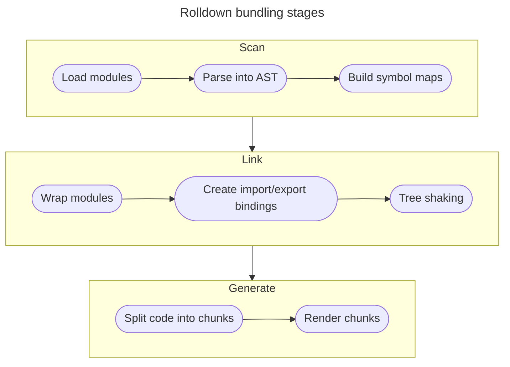
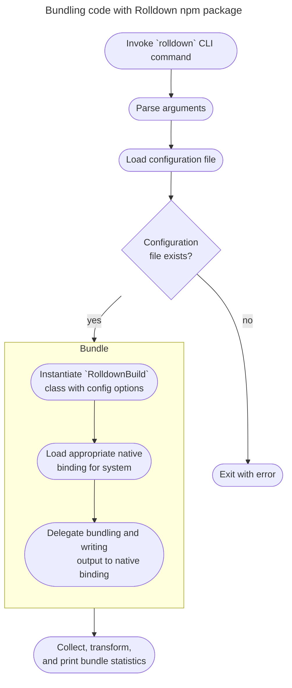

# Architecture

This document provides a high level discussion of how Rolldown works. The goal of this document is to provide an entry point for understanding the project layout. The primary audience is people who might be interested in modifying or contributing to the Rolldown source code.

## Source code layout

A detailed description of the repository layout is provided [in the repo structure guide](./repo-structure). Below is an overview of the sections which are most important for this document.

- `crates`: Contains the source code for the Rust libraries which power the [`rolldown` npm package](http://npmjs.com/package/rolldown).
- `packages`: Most importantly, contains the source code for the [`rolldown` npm package](http://npmjs.com/package/rolldown).

The root of the repository contains a number of configuration files for both Rust and Node.js toolchains, as well as additional directories for managing the project. As this document is focused on providing an introduction to the source code for the Rolldown library, the source code in `crates` and `packages` will be the most relevant sections.

## Bird's eye view

Rolldown is primarily two things:

1. A bundler written in Rust
2. A CLI and Node.js package published to npm, which delegates bundling functionality to the Rust crate

The bundler is designed to be fully compatible with [Rollup](https://rollupjs.org). The [CLI](#the-cli) is primarily a wrapper around the bundler library, so more detail is given to the bundling mechanics.

Bundling occurs in three broad stages:

1. [**Scan**](#scan): loads modules, parses source files into ASTs, and builds maps of imports, exports, and symbols.
2. [**Link**](#link): wraps modules based on type (CJS/ESM), creates bindings between imports and exports, and performs tree shaking to remove dead code.
3. [**Generate**](#generate): split code into chunks and calculate links between chunks, then render chunks to final bundled representation.

The following flow chart describes the high-level bundling process:

### Scan

The scan stage loads all modules from the inputs defined in the Rolldown config. This stage outputs a set of symbols, entry points, a module table, and an ast table.

Files are loaded and transformed by any applicable plugins, before being parsed by [oxc](https://oxc-project.github.io/).

After parsing, the scan stage builds a map of statements and expressions in the source code. Imports, exports, symbols, references, and side effects are all identified at this stage.

### Link

The linking stage takes the scan stage output and builds a comprehensive graph of the code to be bundled.

Modules are sorted by execution order to ensure the bundle executes correctly. Any circular dependencies are identified and warnings are issued.

Tree shaking is a multi-step process:

1. Imports are bound to exports to build a dependency graph of the source code.
2. Modules are then wrapped according to their module type. CommonJS and ESM modules require different wrappers to process correctly. <!-- TODO: more information on how CommonJS and ESM WrapKind is determined -->
3. Gather all symbols that are referenced in statements.
4. Collect final list of statements that should be included in the final bundle.

The sorted, tree-shaken, wrapped modules are then passed to the generate stage for chunking and rendering.

### Generate

The generate stage is responsible for code splitting and rendering the file code artifacts.

Modules are assigned to chunks based on their external references. Modules can be assigned to multiple chunks.

<!-- TODO: more information about how modules are assigned to chunks, and how cross-chunk links are identified -->

Chunks are then rendered to their final code representation, and the assets are returned with any warnings and errors accumulated during the bundling process.

## The CLI

The Rolldown CLI is a thin wrapper around the [Node.js bindings](https://github.com/rolldown/rolldown/tree/2011bf463b8cead1903375046643abb1168ef46f/crates/rolldown_binding) of the [`rolldown` Rust crate](https://github.com/rolldown/rolldown/tree/2011bf463b8cead1903375046643abb1168ef46f/crates/rolldown). Below is a simple flowchart describing the process of calling the `rolldown` CLI command.

