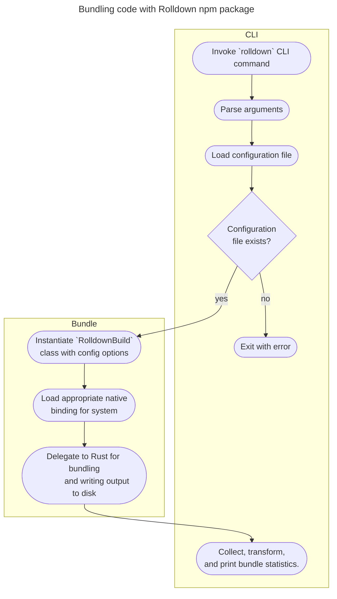

# Architecture

This document covers the organization of the repository, as well as some high level discussion of how Rolldown works. The goal of this document is to provide an entry point for understanding the project layout. The primary audience is people who might be interested in modifying or contributing to the Rolldown source code.

## Source code layout

A detailed description of the repository layout is provided [in the repo structure guide](./repo-structure). Below is an overview of the sections which are most important for this document.

- `crates`: Contains the source code for the Rust libraries which power the [`rolldown` npm package](http://npmjs.com/package/rolldown).
- `packages`: Most importantly, contains the source code for the [`rolldown` npm package](http://npmjs.com/package/rolldown).

The root of the repository contains a number of configuration files for both Rust and Node.js toolchains, as well as additional directories for managing the project. As this document is focused on providing an introduction to the source code for the Rolldown library, the source code in `crates` and `packages` will be the most relevant sections.

## Bird's eye view

Rolldown is primarily two things:

1. A bundler written in Rust
2. A CLI and Node.js package published to npm, which delegates bundling functionality to the Rust crate

The bundler is designed to be fully compatible with [Rollup](https://rollupjs.org).

## The CLI

The Rolldown CLI is a thin wrapper around the [Node.js bindings](https://github.com/rolldown/rolldown/tree/2011bf463b8cead1903375046643abb1168ef46f/crates/rolldown_binding) of the [`rolldown` Rust crate](https://github.com/rolldown/rolldown/tree/2011bf463b8cead1903375046643abb1168ef46f/crates/rolldown). Here's a simple flowchart describing the process of calling the `rolldown` CLI command.

## The Bundler

More info coming soon!
